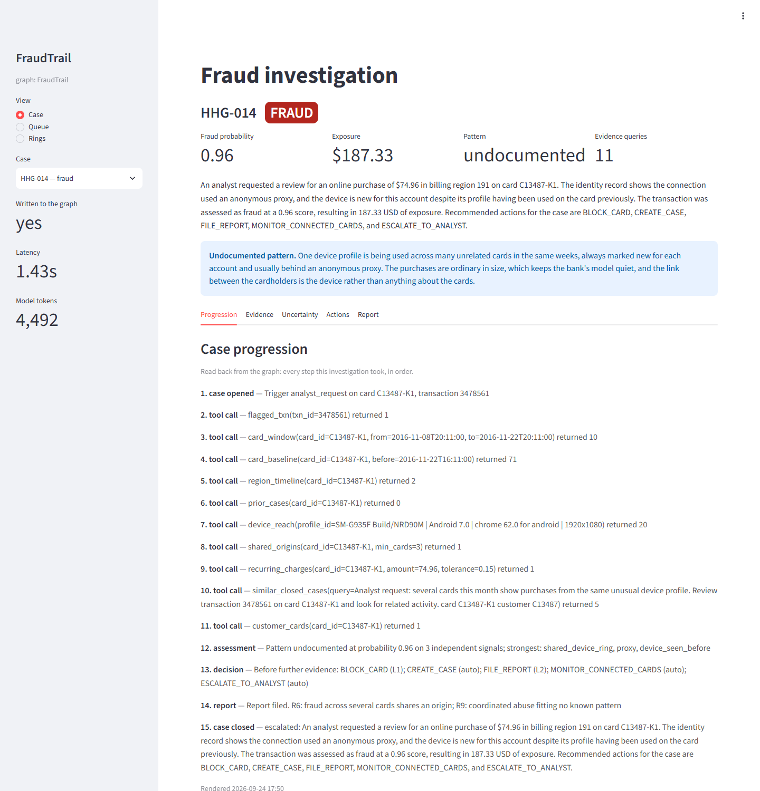
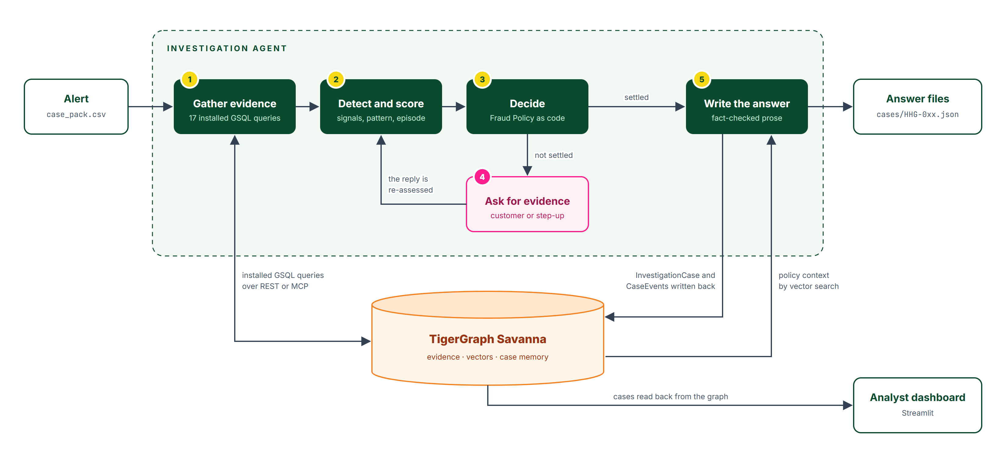
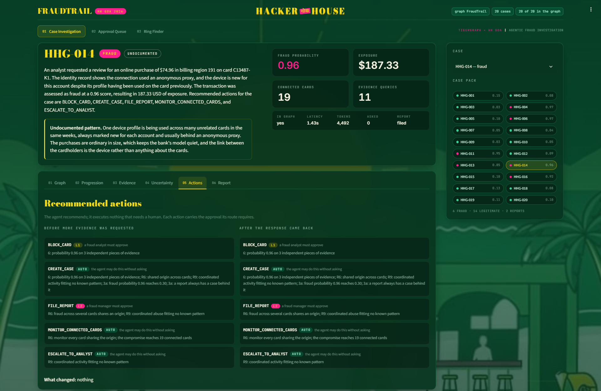
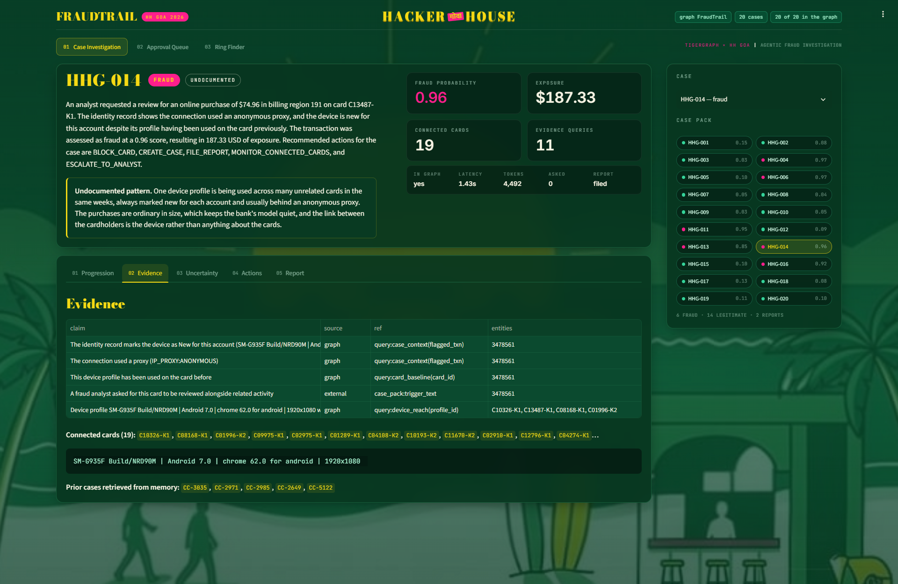
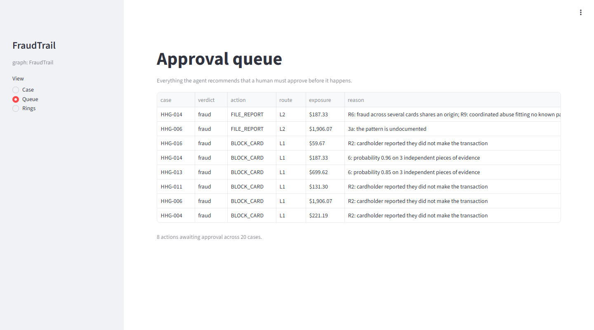
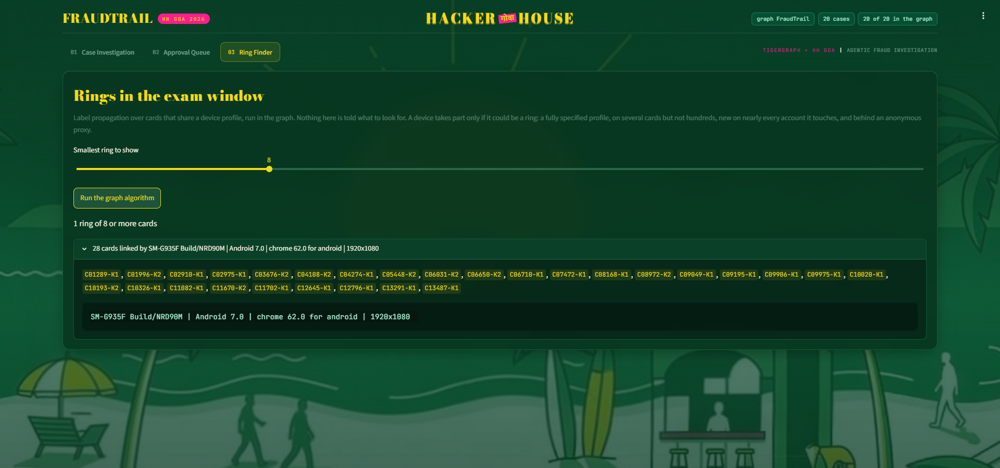
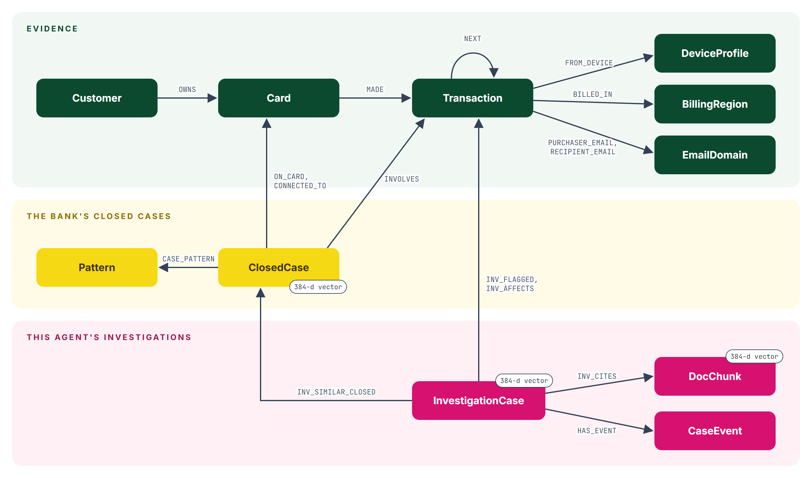

# FraudTrail

An agent that investigates card fraud on TigerGraph. It takes an alert, gathers evidence from
the graph, works out what kind of fraud it is and how far it reaches, asks for more evidence
when what it has does not settle the question, and recommends what the bank should do and who
must approve it. Every finished case is written back into the graph as memory for the next one.

Built for the TigerGraph × Hacker House Goa challenge on the HHGOA_IEEE dataset.



## Contents

- [The problem](#the-problem)
- [The dataset](#the-dataset)
- [System architecture](#system-architecture)
- [The investigation pipeline](#the-investigation-pipeline)
- [The analyst dashboard](#the-analyst-dashboard)
- [Inside the graph](#inside-the-graph)
- [Results](#results)
- [Measured accuracy](#measured-accuracy)
- [How the answers are kept correct](#how-the-answers-are-kept-correct)
- [Running it](#running-it)
- [Project layout](#project-layout)
- [Known limitations](#known-limitations)

## The problem

A bank's fraud model scores every transaction on its own, and most of what it flags is
legitimate. The fraud that costs most is the fraud a per-transaction score cannot see: one
device working through twenty cardholders' cards with purchases small enough to look ordinary,
or a burst of charges each sitting just under a limit. Those cases are only visible as
connections, between cards, devices, customers and the bank's own past decisions.

An analyst working an alert has to find those connections, decide what happened, stay inside
the bank's Fraud Policy on what may be done and who must approve it, and leave a case file a
regulator can read. FraudTrail does that work and leaves the approval to a person.

## The dataset

| | |
| --- | --- |
| Transactions | 590,742 |
| Cards | 14,318, reconstructed per customer from the issuer fields |
| Customers | 13,553 |
| Device profiles | 9,705 |
| Closed cases, with the analysts' notes and outcomes | 5,565 |
| Exam cases to investigate | 20 |

Alongside the data come a Fraud Policy (fourteen actions, three approval routes, rules R1 to
R10, a stopping rule), five documented fraud patterns, and a list of regulatory references.
The dataset has no card column, so cards are derived; the rule and how it was checked are in
[`docs/data_findings.md`](docs/data_findings.md).

## System architecture



The graph finds the evidence and code makes the decisions. TigerGraph plays four parts:

- **Evidence store.** 590,742 transactions and 2.5M edges. The joins an investigator cares
  about are edges: a card to its transactions, a transaction to the device behind it, a closed
  case to the transactions it covered and the cards it named as connected.
- **Query engine.** Every question is an installed GSQL query, so the traversal runs where the
  data is. Seventeen are installed.
- **Vector store.** Every closed-case note and every section of the policy, the patterns and
  the regulatory references carry a 384-dimension embedding, searched with `vectorSearch`.
- **Case memory.** Each finished investigation is written back, step by step, and is what the
  next investigation retrieves and what the dashboard displays.

The agent can reach the graph through the TigerGraph MCP server instead of REST
(`run_agent.py --mcp`): the same installed queries, called as MCP tools over stdio, with the
same answers out the other end.

## The investigation pipeline

Each alert passes through five stages. The example throughout is **HHG-014**, an analyst's
request to review a $74.96 online purchase on card C13487-K1.

### Stage 1: Gather evidence from the graph

**How it works**

- The flagged transaction, the card's recent window and its long-run baseline, where it has
  been used, the bank's earlier cases on the card and on the customer's other cards.
- What is gathered depends on what the first pass found: a device profile is expanded only
  when the flagged transaction has one, and case memory is searched a second time using what
  the detectors found rather than the alert's wording.
- `device_reach` is the query that matters most. Given a device profile and a window, it
  returns every card, customer and transaction behind it, any confirmed-fraud cases, and the
  share of those transactions the bank marked as new for their own account. That share is
  what separates a ring from a browser fingerprint hundreds of unrelated customers share.

**In HHG-014:** eleven queries. The card itself looked unremarkable: no earlier cases, and a
device profile it had used before. `device_reach` showed the rest: the same fully specified
device on 20 cards belonging to 20 customers in the 30 days before the alert, marked new on
every account, behind an anonymous proxy.

### Stage 2: Detect, score and name the pattern

**How it works**

- Detectors look for the documented patterns and their counter-evidence: card-testing
  sequences, bursts of card-not-present purchases, bursts just under a limit, use outside the
  cardholder's region, recurring charges, and mixed-channel anomalies.
- Case memory contributes signals too: earlier confirmed fraud on the card, or earlier alerts
  cleared when the cardholder confirmed travel or a new phone.
- Signals are grouped into independent families, so three views of the same device do not
  count as three pieces of evidence. The probability, the pattern and the episode (which
  transactions belong to it, and the exposure they add up to) come out of that.
- Activity that fits none of the five documented patterns is named `undocumented` and
  described in words.

**In HHG-014:** fraud at 0.96 on three independent signals. The pattern is undocumented: a
shared-device ring, which the bank's own closed cases describe but never named.

### Stage 3: Decide under the Fraud Policy

**How it works**

- The policy is a specification, so it is code: rules R1 to R10, the case-versus-report rule,
  the exposure definition and the stopping rule live in `src/fraudtrail/policy/`, each
  threshold a named constant citing the rule it comes from.
- Every recommended action carries its approval route: `auto`, `L1` (a fraud analyst) or `L2`
  (a fraud manager). The agent recommends; it never claims to have done anything a person must
  approve.

**In HHG-014:** block the card (L1), open a case, file a suspicious activity report (L2),
monitor the 19 connected cards, and escalate to an analyst.



### Stage 4: Ask for more evidence when the case is not settled

**How it works**

- Policy section 5 and rules R1 and R4 say when the evidence is too weak to act on. The agent
  then asks: customer validation or step-up authentication.
- The round requires the reply to be simulated. The assumed reply follows the strongest
  evidence that does not come from the customer, so it cannot manufacture the answer the agent
  wants, and every assumption is recorded in the answer.
- The answer records the recommendation before the evidence was requested and after the reply,
  and says which clause of the stopping rule ended the investigation.

**In HHG-014:** nothing to ask. Section 6 stopped the investigation because 0.96 on three
independent pieces of evidence is decisive. **HHG-010** shows the other path: the evidence left
it at 0.52, the agent asked the cardholder instead of acting, and the confirmation took it to
0.05, allowed the transaction and closed the case. Ten of the twenty cases asked, and the
recommendation changed in all ten.

### Stage 5: Write the answer and remember the case

**How it works**

- Every fact in the answer comes from the investigation. A language model rewrites the
  templated summary and report narrative into readable prose and does nothing else: its text
  is rejected if it adds or drops an identifier, amount or date, or gives a reason the evidence
  does not, and the template is kept instead.
- For a report narrative, the model is also given the policy sections nearest the case,
  retrieved by vector search, as context for its wording.
- The finished case is written back as an `InvestigationCase` connected to its card, its
  transactions, the devices and the prior cases it drew on, with every step stored in order as
  a `CaseEvent`. A case can be replayed, not only inspected.

**In HHG-014:** a report narrative for the regulator, fifteen case events, and five prior cases
from the bank's history cited as precedent.



## The analyst dashboard

```bash
uv run streamlit run app/dashboard.py
```

Every case is read back out of the graph rather than from the answer files, in five tabs: how
it progressed step by step, the evidence it rests on, how uncertain the agent was and what it
asked for, what it recommends before and after that evidence, and the report when policy calls
for one. `?case=HHG-014` opens a case directly, so one can be shared as a link. The case pack
beside it lists all twenty, marked by verdict.

It wears the Hacker House Goa 2026 theme: the event poster's forest green, yellow and pink,
Bodoni display type, and the Goa beach illustration behind the panels. The palette lives in
`.streamlit/config.toml` and the rest in `app/theme.css`.

The **approval queue** collects everything across the twenty cases that a person must sign
off: eight actions, six at L1 and two at L2.



The **ring finder** runs label propagation in the graph over cards that share a device, with
nothing telling it what to look for. A device takes part only if it could be a ring: a fully
specified profile, on several cards but not hundreds, new on nearly every account it touches,
and behind an anonymous proxy. Across the two-month exam window it finds one ring: the device
behind HHG-014, on 28 cards.



## Inside the graph



Eleven vertex types and twenty-one edge types in three layers: the evidence, the bank's closed
cases, and this agent's own investigations. `ClosedCase`, `InvestigationCase` and `DocChunk`
each carry a 384-dimension embedding (BAAI/bge-small-en-v1.5, computed locally).

| Query | The question it answers |
| --- | --- |
| `case_context` | What was flagged, on which card, from which device |
| `card_window`, `card_baseline` | What else happened on this card lately, and what is normal for it |
| `region_timeline` | Where the card has been used, and when |
| `prior_cases`, `customer_cards` | What the bank decided before about this card and the customer's others |
| `device_reach` | Which cards and customers share this device, and is it new to all of them |
| `shared_origin` | Which devices and email domains this card shares with several other cards |
| `recurring_charges` | Has this card paid a similar amount before |
| `ring_components` | Label propagation: which cards form communities around shared devices |
| `similar_closed_cases`, `similar_investigations` | Vector search over past cases, then a hop to the card each was opened on |
| `doc_search`, `closed_case_notes` | Vector search over the policy, patterns and references; the notes corpus |
| `write_case`, `write_case_event`, `read_case` | Case memory: write an investigation back and read it again |

## Results

Twenty answer files in [`cases/`](cases), one per exam case, each validated before it is
written.

| | |
| --- | --- |
| Verdicts | 6 fraud, 14 legitimate |
| Patterns found | 3 card-not-present from a new device, 1 account takeover, 2 undocumented |
| Reports filed | 2 |
| Cases that asked for more evidence | 10, and the recommendation changed in all 10 |
| Approval routes recommended | 46 auto, 6 L1, 2 L2 |
| Evidence queries per case | 10–11 |
| Cases written to the graph | 20 of 20, with 323 case events between them |

The two undocumented findings are ones the bank's own closed cases describe but never named.
**HHG-014** is the shared-device ring above. **HHG-006** is a burst of four online purchases
just under a $500 limit, $1,906.07 in about forty minutes, each small enough that the bank's
model stayed quiet.

## Measured accuracy

The exam's answer key is not public, so accuracy is measured where truth is written down: the
bank's 5,565 closed cases. `scripts/evaluate.py` replays them as the alerts they started as,
with the case under test hidden from every query so the agent cannot retrieve its own answer,
and compares what it concluded with what the analysts concluded. Sampling is stratified and
seeded, so a change in the score is a change in the agent.

Over 120 replayed cases:

| Measure | Result |
| --- | --- |
| Verdict accuracy | **85.0%** |
| Confirmed fraud called fraud | 80.0% |
| Cleared alerts cleared | 90.0% |
| Pattern named correctly | 56.2% |
| Suspicious transactions found | 47.4% |
| Exposure matched exactly | 38.3% |
| Action agreement (F1) | 58.5% |
| Report decision agreement | 87.5% |

The full report, including the pattern confusion matrix, is in
[`docs/evaluation.md`](docs/evaluation.md).

The harness earned its keep immediately. Verdict accuracy started at 56.7%, and the cause was
not the investigation but the simulated customer reply: alerts the analysts had cleared were
being denied by the assumed cardholder and so came out as fraud. The bank's history says what
that reply should be. Where the agent judges the evidence too weak and asks, the analysts had
cleared 76% of those alerts; of the ones it decides without asking, 86% were confirmed fraud.
A denial is now assumed only where the graph establishes something a cardholder cannot explain
away: a device shared across unrelated cards, a card-testing sequence, or a device already
confirmed in another fraud. That change took verdict accuracy from 56.7% to 85.0% and cost
nothing in fraud recall.

## How the answers are kept correct

- **Two evidence sources agree.** The same investigation runs against TigerGraph or against a
  local DuckDB warehouse over the same data. The twenty answers come out identical on every
  field but one: the prior cases retrieved from memory, which the graph finds by vector search
  and the warehouse by matching words.
- **The same evidence gives the same answer.** Anything the graph returns as an unordered set
  is ordered before it reaches an answer, so a re-run names the same cards in the same order.
- **Every answer is validated before it is written.** Wrong approval routes, a report flag that
  disagrees with the policy, a narrative outside six to twelve sentences, a legitimate verdict
  carrying affected transactions, exposure that does not match the transactions it names, or an
  identifier that is not in the dataset: each is an error, and the run reports it rather than
  hiding it. The current run has none.
- **The model cannot introduce a fact.** Its prose is rejected for an identifier, amount or
  date not in the evidence it was given, for dropping one, or for supplying a reason the
  evidence does not give: "scored 0.57 due to a proxy" asserts something about the bank's model
  that nothing in the case establishes.
- **The model is an upgrade, not a dependency.** With `FRAUDTRAIL_LLM_PROVIDER=none` the agent
  still produces twenty complete, valid answers from templates. A free tier caps each model at a
  few requests a day, so `FRAUDTRAIL_LLM_MODEL` takes several models separated by commas and the
  run moves to the next when one is spent.
- **76 unit tests**, `ruff` and `mypy --strict` clean.

## Running it

Requires Python 3.11+ and [uv](https://docs.astral.sh/uv/). Put the five dataset files
(`README.md`, `transactions.csv`, `identity.csv`, `closed_cases_history.csv`, `case_pack.csv`)
in `data/raw/`, which is git-ignored.

```bash
uv sync
cp .env.example .env     # then fill in TG_HOST and TG_SECRET
```

Build the local warehouse and the files the graph is loaded from:

```bash
uv run python scripts/profile_data.py
uv run python scripts/export_graph.py
```

Create the graph, load it, install the queries, and embed the corpus:

```bash
uv run python scripts/load_graph.py
uv run python scripts/install_queries.py
uv run python scripts/build_embeddings.py
```

Run the agent over all twenty cases:

```bash
uv run python scripts/run_agent.py
```

`--only HHG-014` runs one case, `--out DIR` writes elsewhere, `--mcp` reaches the graph through
the TigerGraph MCP server, and `--offline` takes the evidence from the local DuckDB warehouse
instead of the graph, which needs no workspace at all.

Measure it against the bank's closed cases, and open the dashboard:

```bash
uv run python scripts/evaluate.py --n 120
uv run streamlit run app/dashboard.py
```

Checks:

```bash
uv run ruff check . && uv run mypy --strict src scripts && uv run pytest
```

## Project layout

| Path | What it holds |
| --- | --- |
| `src/fraudtrail/policy/` | The Fraud Policy as code: actions, routes, thresholds, rules R1–R10 |
| `src/fraudtrail/investigate/` | Detectors, scoring, evidence gathering, the investigation loop |
| `src/fraudtrail/evidence/` | One interface, two sources: TigerGraph and the local warehouse |
| `src/fraudtrail/graph/` | TigerGraph client, the MCP client, and case write-back |
| `src/fraudtrail/graphrag/` | The document corpus and local embeddings |
| `src/fraudtrail/answer/` | Answer schema, validation, and the narrators |
| `src/fraudtrail/llm/` | Three providers over plain HTTP, no SDKs |
| `src/fraudtrail/evaluate/` | Replaying closed cases and scoring the agent against them |
| `app/dashboard.py` | The analyst dashboard |
| `graph/` | Schema, vector attributes, loading job, and the installed queries |
| `scripts/` | Profile, export, load, install, embed, run, evaluate |
| `cases/` | One answer file per exam case |
| `docs/` | Data findings, the evaluation report, and the screenshots above |

## Known limitations

- **Customer and analyst replies are simulated**, as the round requires. The assumed reply
  follows the strongest evidence that does not come from the customer; every assumption is
  recorded in `evidence_requests`.
- **Episode scoping is the weakest part.** The agent agrees with the analysts on the verdict
  85% of the time but finds only 47% of the transactions they held responsible, and matches
  their exposure figure on 38% of cases. It groups the wrong transactions into an episode more
  often than it reaches the wrong conclusion, which is where the next work belongs.
- **The investigation's ring test does not check for an anonymous proxy.** In the exam window
  71 device profiles pass its three tests (fully specified, on 3 to 60 cards, new on at least
  80% of their transactions), and only one of them, the device behind HHG-014, is behind an
  anonymous proxy; the other 70 are ordinary Apple and Windows configurations. The dashboard's
  ring finder applies the proxy test. The investigation does not yet, because adding it changes
  decisions and needs a full re-evaluation first.
- **Accuracy is measured against the bank's closed cases, not the exam's answer key**, which is
  not public. A replay resembles the exam but is not it.
- **The regulatory references are cited but not ingested.** The corpus holds the policy, the
  patterns and the reference list from the dataset guide; the linked FinCEN and FATF documents
  are not downloaded.
- **No monitoring mode.** The agent investigates the twenty cases it is given; it does not sweep
  the exam window for alerts of its own.
